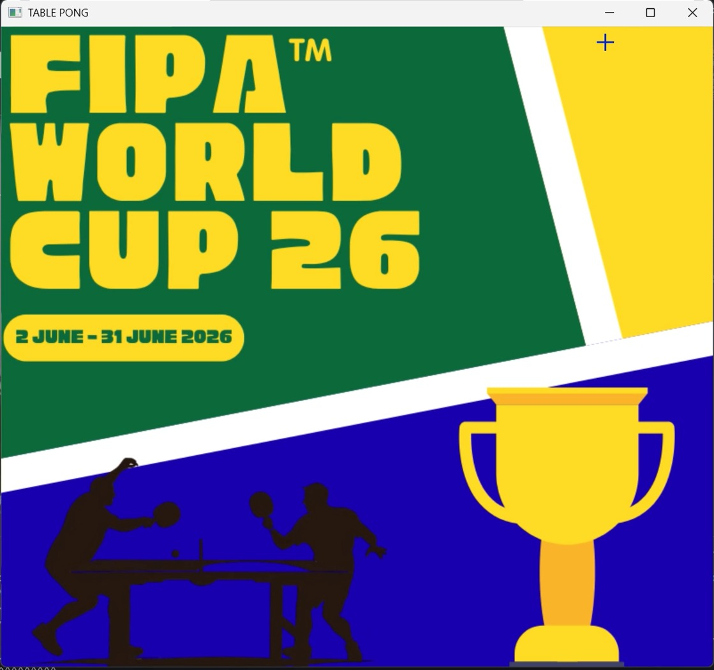

# 🏓 FIPA World Cup : Computer Vision Table Tennis Game

**Nama**  : Bagas Aryo Dananjoyo - 5024241031

> Final Project Pengolahan Citra dan Video  (PCV)  
> Institut Teknologi Sepuluh Nopember (ITS)

FIPA World Cup adalah game tenis meja 3D berbasis Computer Vision yang dikontrol pakai gerakan tangan secara real-time lewat webcam. Pemain cukup menggerakkan tangan di depan kamera untuk mengontrol bet, tanpa perlu controller atau keyboard.

Game ini punya tema turnamen tenis meja internasional, dengan pilihan tim dari 5 negara, 3 venue, efek suara stadion, dan musik tema.



---

## 📑 Daftar Isi

- [Dokumentasi Media](#dokumentasi-media)
- [Fitur Utama](#-fitur-utama)
- [Arsitektur Sistem](#-arsitektur-sistem)
- [Alur Aplikasi (State Machine)](#-alur-aplikasi-state-machine)
- [Kontrol Permainan](#-kontrol-permainan)
- [Penjelasan Kode per Modul](#-penjelasan-kode-per-modul)
  - [main.py](#1-mainpy--application-controller)
  - [hand_detector.py](#2-hand_detectorpy--deteksi-tangan)
  - [game.py](#3-gamepy--logika-permainan)
  - [renderer.py](#4-rendererpy--rendering-visual)
- [Teknik Computer Vision](#-teknik-computer-vision-yang-digunakan)
- [Sistem Audio](#-sistem-audio)
- [Aset](#-aset)
- [Instalasi dan Menjalankan](#-instalasi-dan-menjalankan)
- [Teknologi yang Digunakan](#-teknologi-yang-digunakan)

---

## Dokumentasi Media

Bagian ini berisi dokumentasi visual dari proyek **FIPA World Cup**.

### Cover Proyek


### Video Demo

Video demo permainan dapat diputar langsung melalui player berikut:

<video src="Video.mp4" controls width="100%">
  Browser tidak mendukung pemutaran video langsung. Silakan buka file demo melalui tautan ini: <a href="Video.mp4">Tonton Video Demo</a>.
</video>

[Buka Video Demo](Video.mp4)

Video ini mendokumentasikan alur utama aplikasi, mulai dari tampilan awal, pemilihan tim, kustomisasi venue dan warna bet, sampai gameplay tenis meja berbasis deteksi gesture tangan.

---

## ✨ Fitur Utama

| Fitur | Deskripsi |
|---|---|
| **Kontrol Gesture Tangan** | Menggerakkan bet menggunakan centroid tangan yang dideteksi webcam |
| **Deteksi Gestur FIST / OPEN** | Kepalan tangan (FIST) untuk memilih menu, tangan terbuka (OPEN) untuk navigasi |
| **5 Tim Nasional** | Indonesia 🇮🇩, India 🇮🇳, Jepang 🇯🇵, Brazil 🇧🇷, China 🇨🇳 |
| **3 Venue Turnamen** | Chengdu 🟢, Tokyo 🔵, Vienna 🔴, masing-masing punya skema warna sendiri |
| **3 Warna Bet** | Merah, Biru, Hitam (pakai gambar bet PNG transparan) |
| **Difficulty Dinamis** | Tingkat kesulitan AI otomatis berdasarkan rating bintang tim lawan |
| **Perspektif 3D** | Meja digambar dengan proyeksi perspektif manual (trapesium) |
| **Stadion Bertingkat** | Background gradien vertikal dengan struktur tribun penonton |
| **Crowd Animated** | 400 titik warna-warni yang bergerak menyimulasikan penonton |
| **Efek Suara Non-Blocking** | Audio diputar di background thread agar tidak menyebabkan lag saat collision |
| **Musik Tema** | Themesong yang loop di seluruh layar menu, berhenti saat pertandingan |
| **Skor Dinamis** | Teks skor menggunakan nama negara dan warna identitas nasional |
| **Hold-to-Start** | Tombol START GAME harus ditahan 3 detik untuk mencegah seleksi tidak sengaja |
| **Morphological Operations Manual** | Erode dan Dilate diimplementasikan manual dengan NumPy |
| **Dual Window Display** | Window terpisah untuk game dan kamera deteksi tangan |

---

## 🏗 Arsitektur Sistem

```
┌─────────────────────────────────────────────────────────────┐
│                        main.py                              │
│             (Application Controller / State Machine)        │
├──────────┬──────────────┬───────────────┬───────────────────┤
│          │              │               │                   │
│HandDetector    Game          Renderer       audio.py        │
│(CV Pipeline)  (Physics)     (Draw All)   (MCI + Threading)  │
│          │              │               │                   │
│  webcam ─┤  ball_x ─────┤  draw() ──────┤  themesong.mp3   │
│  HSV mask│  ball_z      │  splash       │  ball_sound.mp3  │
│  contour │  paddle AI   │  team_select  │  crowd.mp3       │
│  centroid│  collision   │  customize    │                   │
│  gesture │  scoring     │  game         │                   │
└──────────┴──────────────┴───────────────┴───────────────────┘

Output Windows:
  ┌──────────────┐  ┌──────────────┐
  │  TABLE PONG  │  │HAND DETECTION│
  │  (Game View) │  │(Camera Feed) │
  └──────────────┘  └──────────────┘
```

---

## 🔄 Alur Aplikasi (State Machine)

```
SPLASH ──(SPACE)──> TEAM_SELECT ──(FIST/ENTER)──> CUSTOMIZE ──(Hold 3s)──> GAME
                                                                             │
                                                        (M) ────────────────┘
                                                     kembali ke SPLASH
```

### Penjelasan State

| State | Deskripsi | Transisi |
|---|---|---|
| `SPLASH` | Menampilkan logo FIPA World Cup fullscreen (800×720). Musik tema mulai diputar. | Tekan **SPACE** → `TEAM_SELECT` |
| `TEAM_SELECT` | Memilih tim pemain (kiri) dan tim lawan (kanan) dari 5 negara. Menampilkan bendera dan rating bintang. | Gesture **FIST** pada tombol CONFIRM atau tekan **ENTER** → `CUSTOMIZE` |
| `CUSTOMIZE` | Memilih venue (Chengdu/Tokyo/Vienna) dan warna bet (Red/Blue/Black). | **FIST** selama 3 detik di tombol START GAME → `GAME` |
| `GAME` | Permainan aktif. Tangan mengontrol bet, bola bergerak, AI melawan. | Tekan **R** untuk restart, **M** untuk kembali ke menu |

---

## 🎮 Kontrol Permainan

### Kontrol Gesture (Webcam)

| Gesture | Aksi |
|---|---|
| **Tangan terbuka (OPEN)** | Menggerakkan kursor / mengontrol posisi bet |
| **Kepalan tangan (FIST)** | Memilih opsi menu / mengkonfirmasi tombol |
| **Gerak horizontal** | Menggerakkan bet ke kiri-kanan saat pertandingan |

### Kontrol Keyboard (Fallback)

| Tombol | Aksi |
|---|---|
| `SPACE` / `ENTER` | Konfirmasi / lanjut ke state berikutnya |
| `1`, `2`, `3` | Pilih venue: Chengdu, Tokyo, Vienna |
| `4`, `5`, `6` | Pilih warna bat: Red, Blue, Black |
| `R` | Restart pertandingan (saat Game Over) |
| `M` | Kembali ke menu utama |
| `Q` / `ESC` | Keluar dari aplikasi |

### Mekanisme Deteksi Gesture

Gesture dideteksi berdasarkan **solidity** (rasio luas kontur terhadap luas convex hull):

```
solidity = area_kontur / area_convex_hull

Jika solidity > 0.88 → FIST (kepalan tangan rapat)
Jika solidity ≤ 0.88 → OPEN (tangan terbuka, ada celah antar jari)
```

---

## 📝 Penjelasan Kode per Modul

### 1. `main.py` (Application Controller)

File ini jadi entry point aplikasi dan bertugas sebagai pusat kendali (orchestrator) dari semua modul.

#### Inisialisasi Komponen

```python
cap = cv2.VideoCapture(0, cv2.CAP_DSHOW)   # Buka webcam (DirectShow API)
cap.set(cv2.CAP_PROP_FRAME_WIDTH, 640)      # Resolusi input 640x480
cap.set(cv2.CAP_PROP_FRAME_HEIGHT, 480)

detector = HandDetector()                    # Pipeline deteksi tangan
game     = Game()                            # Logika dan fisika permainan
renderer = Renderer()                        # Rendering visual
```

#### State Machine Loop

Loop utama (`while True`) baca frame webcam tiap iterasi, jalankan deteksi tangan, terus route logika dan rendering sesuai `app_state`:

```python
while True:
    ret, frame = cap.read()
    frame = cv2.flip(frame, 1)                          # Mirror horizontal
    centroid, gesture, debug_frame = detector.process(frame)  # Deteksi tangan

    # Konversi koordinat webcam (640x480) → koordinat game (800x720)
    cursor_pos = (int((cx / 640.0) * GAME_W), int((cy / 480.0) * GAME_H))

    # Route berdasarkan app_state
    if app_state == 'SPLASH':     ...
    elif app_state == 'GAME':     ...
    elif app_state == 'TEAM_SELECT': ...
    elif app_state == 'CUSTOMIZE':   ...

    cv2.imshow('TABLE PONG', game_canvas)       # Window game
    cv2.imshow('HAND DETECTION', debug_frame)   # Window kamera deteksi
```

#### Hold-to-Start Logic

Di layar CUSTOMIZE, tombol START GAME harus ditahan (FIST) selama 3 detik penuh baru game mulai. Ini supaya tidak ke-trigger secara tidak sengaja:

```python
if start_hold_start_time is None:
    start_hold_start_time = time.time()

hold_progress = min(1.0, (time.time() - start_hold_start_time) / 3.0)

if hold_progress >= 1.0:
    app_state = 'GAME'           # Baru mulai setelah 3 detik penuh
```

#### Sistem Difficulty

Tingkat kesulitan AI ditentukan dari rating bintang tim lawan yang dipilih:

```python
stars = {'INA': 3.0, 'IND': 3.5, 'JPN': 4.0, 'BRA': 4.5, 'CHN': 5.0}.get(enemy_team, 4.0)
game.apply_difficulty(stars)
```

| Tim | Bintang | Kecepatan Bola | Kecepatan AI |
|---|---|---|---|
| Indonesia | ⭐⭐⭐ | 0.7x | Lambat |
| India | ⭐⭐⭐½ | 0.875x | Sedang-Lambat |
| Jepang | ⭐⭐⭐⭐ | 1.05x | Sedang |
| Brazil | ⭐⭐⭐⭐½ | 1.225x | Sedang-Cepat |
| China | ⭐⭐⭐⭐⭐ | 1.4x | Sangat Cepat |

---

### 2. `hand_detector.py` (Deteksi Tangan)

Modul ini berisi pipeline Computer Vision buat mendeteksi tangan dan mengenali gesture secara real-time.

#### Pipeline Deteksi

```
Frame BGR → HSV → Color Masking → Morphology → Contour → Centroid + Gesture
```

##### Langkah 1: Konversi Color Space

```python
hsv = cv2.cvtColor(bgr_frame, cv2.COLOR_BGR2HSV)
```

Frame dikonversi dari BGR ke HSV karena HSV lebih tahan terhadap perubahan pencahayaan dibanding RGB/BGR.

##### Langkah 2: Color Masking (Segmentasi Warna)

```python
LOWER_SKIN = np.array([90, 45, 20])    # Batas bawah HSV (sarung tangan biru)
UPPER_SKIN = np.array([130, 255, 255]) # Batas atas HSV

condition = np.all((hsv >= LOWER_SKIN) & (hsv <= UPPER_SKIN), axis=2)
mask = np.where(condition, np.uint8(255), np.uint8(0))
```

> Deteksi menggunakan rentang warna sarung tangan biru (hue 90-130). Pemain perlu pakai sarung tangan biru atau objek berwarna biru di tangan.

##### Langkah 3: Operasi Morfologi Manual

Operasi erode dan dilate diimplementasikan secara manual pakai NumPy (bukan `cv2.erode`/`cv2.dilate`), sesuai constraint proyek:

```python
def manual_erode(mask, ksize=3):
    """Erosi: pixel = 255 hanya jika SEMUA tetangga dalam kernel bernilai 255"""
    pad = ksize // 2
    padded = np.pad(mask, pad, mode='constant', constant_values=0)
    result = np.ones_like(mask) * 255
    for i in range(ksize):
        for j in range(ksize):
            result = np.minimum(result, padded[i:i+mask.shape[0], j:j+mask.shape[1]])
    return result

def manual_dilate(mask, ksize=3):
    """Dilasi: pixel = 255 jika SALAH SATU tetangga dalam kernel bernilai 255"""
    pad = ksize // 2
    padded = np.pad(mask, pad, mode='constant', constant_values=0)
    result = np.zeros_like(mask)
    for i in range(ksize):
        for j in range(ksize):
            result = np.maximum(result, padded[i:i+mask.shape[0], j:j+mask.shape[1]])
    return result
```

Opening (erode lalu dilate) untuk menghilangkan noise kecil, dan Closing (dilate lalu erode) untuk menutup lubang di mask. Dijalankan di resolusi 1/4 supaya lebih efisien:

```python
small = mask[::2, ::2]                          # Downscale 2x
cleaned = manual_opening(small, ksize=3)         # Hapus noise
cleaned = manual_closing(cleaned, ksize=3)       # Tutup lubang
cleaned = np.repeat(np.repeat(cleaned, 2, ...), 2, ...)  # Upscale kembali
```

##### Langkah 4: Ekstraksi Kontur dan Centroid

```python
contours, _ = cv2.findContours(cleaned, cv2.RETR_EXTERNAL, cv2.CHAIN_APPROX_SIMPLE)
largest = max(contours, key=cv2.contourArea)     # Ambil kontur terbesar

M = cv2.moments(largest)                         # Hitung momen
cx = int(M['m10'] / M['m00'])                    # Centroid X
cy = int(M['m01'] / M['m00'])                    # Centroid Y
```

##### Langkah 5: Deteksi Gesture via Solidity

```python
hull = cv2.convexHull(largest)
hull_area = cv2.contourArea(hull)
solidity = area / float(hull_area)
gesture = "FIST" if solidity > 0.88 else "OPEN"
```

Intinya, tangan yang mengepal (FIST) punya kontur yang rapat dan solid (mendekati convex hull), sementara tangan terbuka ada celah antar jari jadi solidity-nya lebih rendah.

---

### 3. `game.py` (Logika Permainan)

Modul ini mengatur fisika bola, pergerakan AI, deteksi tabrakan, dan sistem skor.

#### Koordinat Permainan

```
Sumbu X: 0.0 (kiri) ─────── 1.0 (kanan)
Sumbu Z: 0.0 (dekat/pemain) ─── 1.0 (jauh/AI)
```

Semua posisi dinormalisasi ke rentang [0.0, 1.0] agar independen terhadap resolusi layar.

#### Fisika Bola

```python
self.ball_x += self.ball_vx    # Gerak horizontal
self.ball_z += self.ball_vz    # Gerak kedalaman (menuju/menjauh pemain)
```

Kecepatan bola naik sedikit tiap kena paddle (`*= -1.05`), dan naik lebih banyak tiap pemain cetak skor (`+= 0.15`), jadi makin lama makin cepat.

#### Deteksi Tabrakan

```python
# Pemain (Z melintasi 0.0)
if prev_z >= 0.0 and self.ball_z < 0.0:
    if abs(self.ball_x - self.player_x) <= PADDLE_WIDTH / 2.0:
         # HIT, pantulkan bola
        self.ball_vz *= -1.05

        # Efek spin: gabungan posisi kontak + kecepatan ayunan tangan
        swing_impact = self.player_dx * 0.6
        pos_impact = (self.ball_x - self.player_x) * 0.05
        self.ball_vx = pos_impact + swing_impact
    else:
         self._trigger_point('AI')  # MISS, lawan dapat poin
```

#### AI (Kecerdasan Buatan)

AI bergerak menuju posisi bola dengan kecepatan yang disesuaikan dengan tingkat kesulitan:

```python
ai_speed = (0.01 + ((stars - 3.0) / 2.0) * 0.025) * ball_speed
diff = self.ball_x - self.ai_x
self.ai_x += max(-ai_speed, min(ai_speed, diff))
```

AI juga punya target logic, yaitu mengarahkan bola ke sisi yang berlawanan dari posisi pemain:

```python
if self.player_x < 0.5:
    target_x = random.uniform(0.6, 0.9)   # Arahkan ke kanan
else:
    target_x = random.uniform(0.1, 0.4)   # Arahkan ke kiri
```

Pada difficulty rendah (3.5 bintang ke bawah), AI punya 50% kemungkinan salah arah.

#### Game States

```
waiting ──(hand terdeteksi 1.5s)──> playing ──(skor)──> point_scored ──(1.5s)──> playing
                                                            │
                                                    (skor = 7) ──> game_over
```

---

### 4. `renderer.py` (Rendering Visual)

Modul paling besar, bertugas menggambar semua elemen visual pakai OpenCV drawing primitives.

#### Proyeksi Perspektif 3D

Meja digambar sebagai trapesium untuk bikin kesan kedalaman:

```python
FAR_LEFT   = (150, 260)   # Titik jauh kiri  (lebih sempit)
FAR_RIGHT  = (650, 260)   # Titik jauh kanan (lebih sempit)
NEAR_LEFT  = (50,  680)   # Titik dekat kiri (lebih lebar)
NEAR_RIGHT = (750, 680)   # Titik dekat kanan (lebih lebar)

def to_screen(game_x, game_z):
    """Konversi koordinat game (0-1, 0-1) → koordinat pixel layar"""
    left_edge  = NEAR_LEFT[0]  + game_z * (FAR_LEFT[0]  - NEAR_LEFT[0])
    right_edge = NEAR_RIGHT[0] + game_z * (FAR_RIGHT[0] - NEAR_RIGHT[0])
    y_screen   = NEAR_LEFT[1]  + game_z * (FAR_LEFT[1]  - NEAR_LEFT[1])
    x_screen   = left_edge + game_x * (right_edge - left_edge)
    return int(x_screen), int(y_screen)
```

#### Venue System

Tiga venue dengan profil warna berbeda:

| Venue | Lantai Meja (floor_col) | Background Stadion (bg_col) | Garis |
|---|---|---|---|
| **CHENGDU** 🟢 | `(50, 120, 40)` Hijau turnamen | `(90, 50, 30)` Navy/blue-grey | Putih |
| **TOKYO** 🔵 | `(200, 100, 20)` Olympic Blue | `(40, 40, 100)` Terracotta | Putih |
| **VIENNA** 🔴 | `(40, 30, 150)` Burgundy/Merah | `(30, 30, 30)` Charcoal | Krem |

#### Background Stadion dengan Gradient

Background bukan warna flat, tapi pakai gradasi vertikal supaya ada kesan pencahayaan stadium:

```python
multipliers = np.linspace(0.4, 1.5, H)   # Atas gelap (40%), bawah terang (150%)
gradient = np.stack([b * mult, g * mult, r * mult], axis=2)
canvas[:] = gradient
```

Ada juga garis tribun horizontal dan vertikal buat simulasi tempat duduk penonton.

#### Crowd Animation

400 titik warna-warni statis buat simulasi penonton, plus efek camera flash yang berkedip tiap frame:

```python
self.crowd_x = np.random.randint(0, W, 400)
self.crowd_y = np.random.randint(20, 250, 400)

# Camera flashes (dynamic per frame)
np.random.seed(int(time.time() * 15) % (2**32))
flash_count = np.random.randint(0, 4)
```

#### Sistem Skor Dinamis

Teks skor menampilkan nama negara dengan warna khas nasional. Tekniknya: teks digambar dua kali (outline tebal dulu, lalu inner tipis di atasnya):

| Tim | Warna Teks (Inner) | Warna Outline (Outer) |
|---|---|---|
| **Brazil** | Kuning `(0, 255, 255)` | Hijau `(0, 100, 0)` |
| **India** | Oren `(0, 140, 255)` | Putih `(255, 255, 255)` |
| **China** | Merah `(0, 0, 255)` | Merah Tua `(0, 0, 100)` |
| **Jepang** | Putih `(255, 255, 255)` | Merah `(0, 0, 200)` |
| **Indonesia** | Merah `(0, 0, 255)` | Putih `(255, 255, 255)` |

```python
# Teknik outline text: gambar teks tebal dulu, lalu teks tipis di atasnya
cv2.putText(canvas, txt, pos, font, scale, outer_col, 9)   # Outline
cv2.putText(canvas, txt, pos, font, scale, inner_col, 4)   # Inner
```

#### Paddle dengan Gambar Bet (PNG Transparan)

Paddle pemain pakai gambar bet PNG (RGBA) yang di-resize dan dirotasi sesuai kecepatan gerakan tangan:

```python
tilt_deg = max(-35.0, min(35.0, dx * 400.0))
M = cv2.getRotationMatrix2D(rot_center, -tilt_deg, 1.0)
rotated = cv2.warpAffine(resized, M, (new_w, new_h), borderValue=(0, 0, 0, 0))

# Alpha blending ke canvas
alpha = roi[:, :, 3] / 255.0
canvas[y1:y2, x1:x2] = (alpha * fg + (1 - alpha) * bg)
```

Tersedia 3 gambar bet: `batmerah.png`, `batbiru.png`, `bathitam.png`. Jika gambar tidak ditemukan, fallback ke ellipse sederhana.

---

## 🔬 Teknik Computer Vision yang Digunakan

| # | Teknik | Implementasi | File |
|---|---|---|---|
| 1 | **Color Space Conversion** | BGR → HSV untuk segmentasi warna | `hand_detector.py` |
| 2 | **Color-based Segmentation** | Thresholding pada range HSV biru | `hand_detector.py` |
| 3 | **Morphological Erosion** | Implementasi manual NumPy (min filter) | `hand_detector.py` |
| 4 | **Morphological Dilation** | Implementasi manual NumPy (max filter) | `hand_detector.py` |
| 5 | **Opening & Closing** | Kombinasi erode-dilate / dilate-erode | `hand_detector.py` |
| 6 | **Contour Detection** | `cv2.findContours` untuk menemukan area tangan | `hand_detector.py` |
| 7 | **Image Moments** | `cv2.moments` untuk menghitung centroid | `hand_detector.py` |
| 8 | **Convex Hull** | `cv2.convexHull` untuk deteksi gesture | `hand_detector.py` |
| 9 | **Solidity Analysis** | Rasio luas kontur vs convex hull | `hand_detector.py` |
| 10 | **Perspective Projection** | Transformasi koordinat 2D → tampilan 3D | `renderer.py` |
| 11 | **Alpha Blending** | Overlay gambar RGBA (bendera) ke canvas BGR | `renderer.py` |
| 12 | **Geometric Drawing** | Polygon, circle, rectangle, line untuk UI | `renderer.py` |

---

## 🔊 Sistem Audio

Audio dikelola lewat Windows MCI API via `ctypes` (modul `audio.py`), tanpa library eksternal. Semua pemanggilan audio berjalan non-blocking pakai `threading.Thread` supaya tidak bikin lag di game loop.

| Alias | File | Kondisi |
|---|---|---|
| `theme` | `themesong.mp3` | Loop di menu (SPLASH, TEAM_SELECT, CUSTOMIZE). Stop saat GAME. |
| `crowd` | `crowd.mp3` | Play saat *waiting*, *point_scored*, dan *game_over*. Stop saat rally aktif. |
| `ball0`–`ball3` | `ball_sound.mp3` | Play setiap bola mengenai paddle atau dinding. Menggunakan 4 alias bergiliran agar suara bisa overlap. |

Implementasi menggunakan `mciSendStringW` dari `winmm.dll` bawaan Windows, dijalankan di daemon thread:

```python
import ctypes
import threading

winmm = ctypes.windll.winmm

def _play_async(alias, filepath, loop):
    winmm.mciSendStringW(f'stop {alias}', ...)
    winmm.mciSendStringW(f'close {alias}', ...)
    winmm.mciSendStringW(f'open "{filepath}" type mpegvideo alias {alias}', ...)
    winmm.mciSendStringW(f'play {alias} repeat', ...)

def play(alias, filepath, loop=False):
    t = threading.Thread(target=_play_async, args=(alias, filepath, loop), daemon=True)
    t.start()
```

Path audio pakai `os.path.dirname(__file__)` supaya tidak tergantung CWD saat program dijalankan.

---

## 📁 Aset

```
cover.jpeg                    # Cover dokumentasi proyek
Video.mp4                     # Video demo permainan

asset/
├── Logo.png                    # Logo splash screen FIPA World Cup
├── themesong.mp3               # Musik tema menu
├── ball_sound.mp3              # Efek suara pantulan bola
├── crowd.mp3                   # Efek suara riuh penonton
├── batmerah.png                # Gambar bet merah (RGBA)
├── batbiru.png                 # Gambar bet biru (RGBA)
├── bathitam.png                # Gambar bet hitam (RGBA)
├── scoreboard.png              # (Aset cadangan)
├── indonesia_round_icon_64.png # Bendera Indonesia (40x40)
├── india_round_icon_64.png     # Bendera India
├── japan_round_icon_64.png     # Bendera Jepang
├── brazil_round_icon_64.png    # Bendera Brazil
└── china_round_icon_64.png     # Bendera China
```

---

## 🚀 Instalasi dan Menjalankan

### Prasyarat

- **Python 3.10+**
- **Webcam** yang terhubung
- **Sarung tangan biru** atau objek biru di tangan untuk deteksi

### Instalasi Dependencies

```bash
pip install opencv-python numpy
```

> Tidak perlu `pygame` atau library audio eksternal. Audio ditangani `ctypes` + `winmm.dll` + `threading` bawaan Windows/Python.

### Menjalankan Aplikasi

```bash
cd "FIPA World Cup"
python main.py
```

### Cara Bermain

1. Jalankan `main.py`, akan muncul **2 window**: game (TABLE PONG) dan kamera deteksi (HAND DETECTION)
2. Tekan **SPACE** untuk masuk ke pemilihan tim
3. Kepalkan tangan (**FIST**) di atas nama tim untuk memilih, lalu tekan tombol **CONFIRM**
4. Pilih **venue** dan **warna bat** di layar kustomisasi
5. Tahan (**FIST**) pada tombol **START GAME** selama 3 detik
6. Gerakkan tangan kiri-kanan untuk mengendalikan bet
7. Skor pertama mencapai **7 poin** menang!

---

## 🛠 Teknologi yang Digunakan

| Teknologi | Versi | Kegunaan |
|---|---|---|
| **Python** | 3.12 | Bahasa pemrograman utama |
| **OpenCV** | 4.x | Capture webcam, image processing, rendering |
| **NumPy** | 1.x | Operasi array, morphology manual, gradient |
| **ctypes** | (built-in) | Interface ke Windows MCI API untuk audio |
| **winmm.dll** | (Windows) | Memutar file MP3 via MCI (Media Control Interface) |

---
